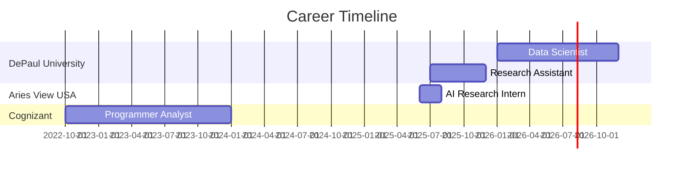

<div align="center">


</div>

<div align="center">

[](https://git.io/typing-svg)

</div>

<div align="center">

[](https://linkedin.com/in/jaya-prakash-yadav-ai)
[](https://github.com/jpmartin22)
[](mailto:jayaprakashyadav@gmail.com)
[](https://github.com/jpmartin22)


</div>

<br/>

## 🏆 Achievements & Recognition

<div align="center">

<table>
<tr>
<td align="center" width="50%">

### 🥇 Winner
**DePaul Propel Hackathon 2025**

</td>
<td align="center" width="50%">

### 🥇 Winner
**NEIU Eagle Hack Fest 2025**

</td>
</tr>
<tr>
<td align="center" colspan="2">

### 🌟 AI & Data Science Spotlight - Spring Pod (Feb 2025)

</td>
</tr>
</table>

[](https://github.com/ryo-ma/github-profile-trophy)

</div>

---

## 👨‍💻 About Me

```python
class JayaPrakashYadavGorla:
    def __init__(self):
        self.name = "Jaya Prakash Yadav Gorla"
        self.role = "AI/ML Engineer & Researcher"
        self.location = "Chicago, IL 🌆"
        self.education = "M.S. Artificial Intelligence @ DePaul University (GPA: 3.47)"
        self.graduation = "June 2026"
        
        self.expertise = {
            "machine_learning": ["Predictive Modeling", "Feature Engineering", "MLOps"],
            "nlp_llm": ["RAG Systems", "LangChain", "BERT", "GPT", "Fine-tuning"],
            "robotics_rl": ["World Models", "Dreamer", "Motion Planning", "ROS 2"],
            "data_engineering": ["ETL Pipelines", "DuckDB", "PostgreSQL", "Apache Spark"]
        }
        
        self.current_work = {
            "position": "Data Scientist @ DePaul University",
            "focus": [
                "Production RAG pipelines processing 1,000+ documents/week",
                "Patent analytics for 50,000+ biopharma records",
                "World model RL (86.4% lane-keeping, 0.0% off-road time)"
            ]
        }
        
        self.impact = {
            "accuracy_improvements": "40% gain in legal document processing",
            "time_reduction": "85% (10+ hrs → 90 min via automation)",
            "model_performance": "R² = 0.763 for price prediction",
            "grant_support": "2+ funded proposals through analytics"
        }
    
    def say_hi(self):
        print("Thanks for stopping by! Let's build something amazing together 🚀")

me = JayaPrakashYadavGorla()
me.say_hi()
```

---

## 🛠️ Tech Stack & Skills

<div align="center">

### 💻 Languages


### 🤖 ML/AI Frameworks


### 🧠 Specialized Skills


### ☁️ Cloud & MLOps


### 🗄️ Databases & Data Tools


</div>

---

## 📊 GitHub Stats

<div align="center">


</div>

<div align="center">

[](https://git.io/streak-stats)

</div>

<div align="center">

[](https://github.com/ashutosh00710/github-readme-activity-graph)

</div>

---

## 🚀 Featured Projects

<div align="center">

<table>
<tr>
<td width="50%">

### 🤖 Tiny Dreamer - World Model RL
**Tech Stack:** `PyTorch` `RL` `RSSM` `World Models`

- 🎯 **86.4% lane-keeping** success rate
- 🚗 **0.0% off-road time** in evaluation
- 📈 Trained on **700K+ environment steps**
- ⚙️ CAPS regularization: **0.939 smoothness**

[Explore Project →](https://github.com/jpmartin22)

</td>
<td width="50%">

### 🧠 Agentic RAG - Cleantech Q&A
**Tech Stack:** `LangChain` `ChromaDB` `Semantic Search`

- ✅ **88% answer correctness** 
- 📚 Indexed **20,000+ articles**
- 🔍 Sub-second similarity search
- 🚀 **22% improvement** over baseline

[Explore Project →](https://github.com/jpmartin22)

</td>
</tr>
<tr>
<td width="50%">

### 🏠 Airbnb Price Prediction
**Tech Stack:** `LightGBM` `XGBoost` `Feature Engineering`

- 📊 **R² = 0.763** on 48,000+ listings
- 🗺️ Geospatial & temporal features
- 📈 **31% performance improvement**
- ⚡ Bayesian hyperparameter tuning

[Explore Project →](https://github.com/jpmartin22)

</td>
<td width="50%">

### 🛒 Multimodal Recommender
**Tech Stack:** `BERT` `Vision Transformers` `FastAPI`

- 🎨 Visual-textual embeddings
- 📦 **100K+ product** listings
- 🎯 **25% precision improvement**
- ⚡ **<200ms** inference time

[Explore Project →](https://github.com/jpmartin22)

</td>
</tr>
</table>

</div>

---

## 💼 Professional Experience

<div align="center">



</div>

### 🔬 Data Scientist | DePaul University
*Jan 2026 - Present*

- 🏆 Led analytics for **50,000+ biopharma patents** using network science & entropy metrics
- ⚡ Reduced processing time by **85%** (10+ hrs → 90 min)
- 📊 Built ETL pipelines processing **100,000+ JSONL records**
- 💡 Supported **2+ funded grant proposals** with data-driven insights

### 🤖 AI Research Intern | Aries View USA
*Jun 2025 - Aug 2025*

- 🔍 Built **OCR-based RAG pipeline** processing **1,000+ legal docs/week**
- 📈 Achieved **40% accuracy gain** and **85% F1 score**
- ⚡ Cut query latency by **25%**, scaled to **10,000+ daily queries**
- 🔧 Optimized PostgreSQL vector indexes & CI/CD automation

---

## 📜 Certifications

<div align="center">

| Certification | Issuer | Year |
|:---:|:---:|:---:|
| 🏅 AWS Certified ML - SageMaker | Amazon Web Services | 2025 |
| 🎓 Google Cloud Gen AI Professional | Google Cloud | 2025 |
| 🤖 AI Agents Fundamentals | Hugging Face | 2025 |
| 🔧 Postman API Expert | Postman | 2025 |
| ☁️ AWS ML Foundations | Amazon Web Services | 2025 |

</div>

---

## 📈 Key Metrics & Impact

<div align="center">

| Metric | Value | Impact Area |
|:---:|:---:|:---:|
| 📊 Patents Analyzed | **50,000+** | Innovation Analytics |
| ⏱️ Time Saved | **85%** reduction | Process Automation |
| 🎯 Model Accuracy | **R² = 0.763** | Predictive Modeling |
| 🤖 Lane Keeping | **86.4%** | Autonomous Systems |
| 📚 Documents Processed | **1,000+/week** | NLP Pipeline |
| 💰 Grants Supported | **2+ funded** | Research Impact |
| ⚡ Latency Reduction | **25%** | System Optimization |
| ✅ RAG Accuracy | **88%** | Q&A Systems |

</div>

---

## 🎓 Education

<div align="center">

### 🏛️ DePaul University
**Master of Science in Artificial Intelligence**  
📅 Expected June 2026 | 📍 Chicago, IL  
🎯 GPA: 3.47/4.0

**Key Coursework:**
- Advanced Robotics & Motion Planning
- Deep Learning & Neural Networks  
- Natural Language Processing
- Reinforcement Learning & Control Systems
- Data Engineering & MLOps

</div>

---

## 📫 Let's Connect!

<div align="center">

[](https://git.io/typing-svg)

<br/>

📧 **Email:** jayaprakashyadav@gmail.com  
💼 **LinkedIn:** [linkedin.com/in/jaya-prakash-yadav-ai](https://linkedin.com/in/jaya-prakash-yadav-ai)  
🐙 **GitHub:** [github.com/jpmartin22](https://github.com/jpmartin22)  
📍 **Location:** Chicago, IL  
📱 **Phone:** 312-404-5135

<br/>

<a href="mailto:jayaprakashyadav@gmail.com">
  
</a>
<a href="https://linkedin.com/in/jaya-prakash-yadav-ai">
  
</a>
<a href="https://github.com/jpmartin22">
  
</a>

</div>

---

<div align="center">

## 🐍 Contribution Snake

<!-- To enable this animation, you need to set up GitHub Actions. See instructions below -->


</div>

<details>
<summary>📝 Click to see Snake Animation Setup Instructions</summary>

<br/>

To enable the snake animation eating your contributions:

1. Create a file `.github/workflows/snake.yml` in your GitHub profile repository
2. Add the following content:

```yaml
name: Generate Snake

on:
  schedule:
    - cron: "0 */12 * * *"  # Every 12 hours
  workflow_dispatch:
  push:
    branches:
      - main

jobs:
  build:
    runs-on: ubuntu-latest
    steps:
      - name: Checkout
        uses: actions/checkout@v3
        
      - name: Generate Snake
        uses: Platane/snk@v3
        id: snake-gif
        with:
          github_user_name: jpmartin22
          outputs: |
            dist/github-contribution-grid-snake.svg
            dist/github-contribution-grid-snake-dark.svg?palette=github-dark
            
      - name: Push to output branch
        uses: crazy-max/ghaction-github-pages@v3.1.0
        with:
          target_branch: output
          build_dir: dist
        env:
          GITHUB_TOKEN: ${{ secrets.GITHUB_TOKEN }}
```

3. Commit and push - the action will run automatically!

</details>

---

<div align="center">


### 💡 "Building intelligent systems that learn, reason, and act autonomously"

[](https://github.com/jpmartin22)

**⭐ If you find my work interesting, consider starring my repositories!**

</div>
